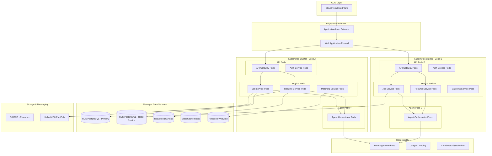
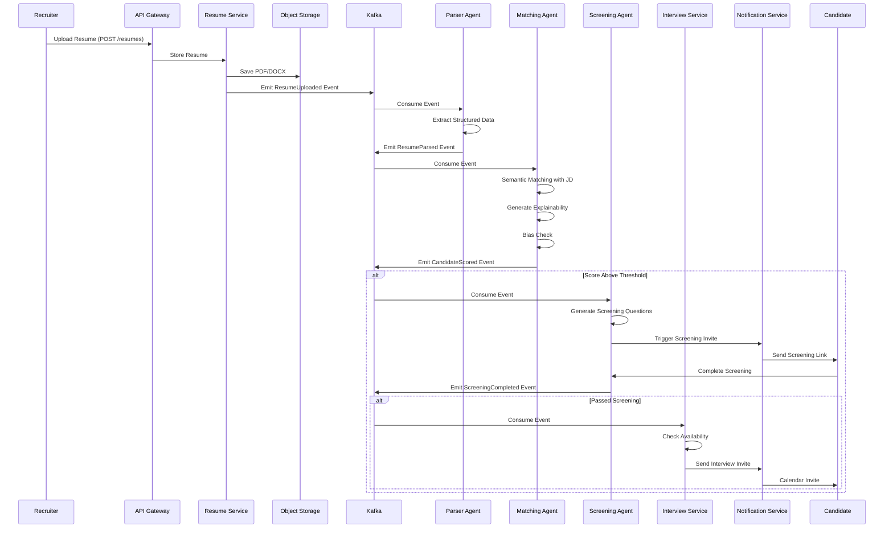
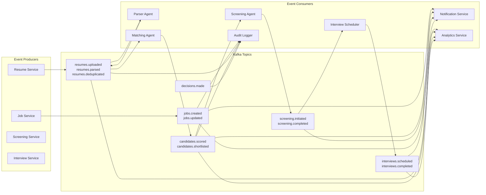
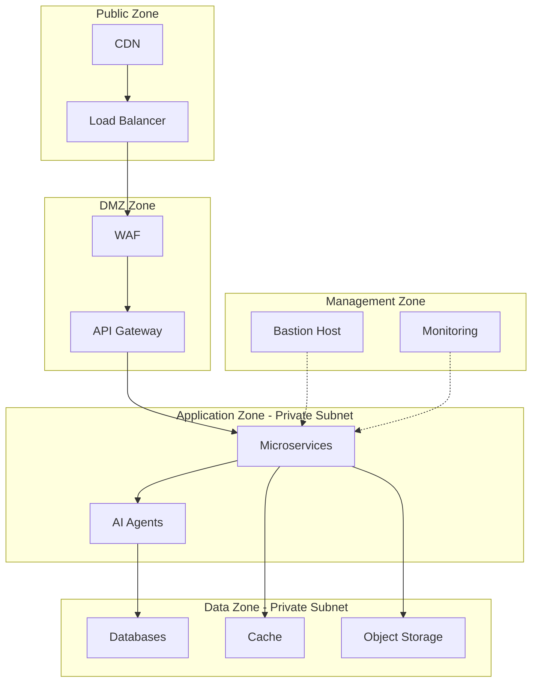

# System Architecture - AI Hiring Platform

## 1. High-Level Architecture

### 1.1 Logical Architecture

```mermaid
graph TB
    subgraph "Client Layer"
        WEB[Web App - React/Next.js]
        MOBILE[Mobile App - React Native]
        API_CLIENT[External API Clients]
    end

    subgraph "API Gateway & Auth"
        APIGW[API Gateway]
        AUTH[Auth Service]
        RATELIMIT[Rate Limiter]
    end

    subgraph "Core Microservices"
        TENANT[Tenant Management]
        JOB[Job Management]
        RESUME[Resume Ingestion]
        MATCH[AI Matching Engine]
        SCREEN[AI Screening Service]
        INTERVIEW[Interview Orchestration]
        VOICE[Voice AI Service]
        DECISION[Decision Engine]
        NOTIF[Notification Service]
    end

    subgraph "AI & Agent Layer"
        AGENT_ORCH[LangGraph Agent Orchestrator]
        AGENT_MATCH[Matching Agent]
        AGENT_SCREEN[Screening Agent]
        AGENT_VOICE[Voice Interview Agent]
        AGENT_DECISION[Decision Agent]
        EXPLAINER[Explainability Engine]
        BIAS[Bias Detection]
    end

    subgraph "Data Layer"
        POSTGRES[(PostgreSQL - Transactional)]
        MONGO[(MongoDB - Documents)]
        VECTOR[(Vector DB - Embeddings)]
        REDIS[(Redis - Cache)]
        S3[Object Storage - Resumes]
        KAFKA[Event Bus - Kafka]
    end

    subgraph "AI/ML Infrastructure"
        LLM[LLM Gateway - OpenAI/Anthropic]
        EMBED[Embedding Service]
        VOICE_STT[Speech-to-Text]
        VOICE_TTS[Text-to-Speech]
        PROMPT_MGR[Prompt Manager]
    end

    subgraph "Platform Services"
        AUDIT[Audit Logger]
        METRICS[Metrics & Monitoring]
        CONSENT[Consent Manager]
        SEARCH[Search Service - Elasticsearch]
        SCHEDULER[Job Scheduler]
        WORKFLOW[Workflow Engine]
    end

    WEB --> APIGW
    MOBILE --> APIGW
    API_CLIENT --> APIGW
    
    APIGW --> AUTH
    APIGW --> RATELIMIT
    APIGW --> TENANT
    APIGW --> JOB
    APIGW --> RESUME
    APIGW --> MATCH
    APIGW --> SCREEN
    APIGW --> INTERVIEW
    APIGW --> DECISION
    
    JOB --> KAFKA
    RESUME --> KAFKA
    MATCH --> KAFKA
    SCREEN --> KAFKA
    INTERVIEW --> KAFKA
    
    MATCH --> AGENT_ORCH
    SCREEN --> AGENT_ORCH
    VOICE --> AGENT_ORCH
    DECISION --> AGENT_ORCH
    
    AGENT_ORCH --> AGENT_MATCH
    AGENT_ORCH --> AGENT_SCREEN
    AGENT_ORCH --> AGENT_VOICE
    AGENT_ORCH --> AGENT_DECISION
    
    AGENT_MATCH --> LLM
    AGENT_MATCH --> EMBED
    AGENT_SCREEN --> LLM
    AGENT_VOICE --> VOICE_STT
    AGENT_VOICE --> VOICE_TTS
    AGENT_VOICE --> LLM
    
    AGENT_MATCH --> EXPLAINER
    AGENT_DECISION --> EXPLAINER
    AGENT_MATCH --> BIAS
    
    TENANT --> POSTGRES
    JOB --> POSTGRES
    RESUME --> MONGO
    RESUME --> S3
    MATCH --> VECTOR
    MATCH --> REDIS
    
    AUDIT --> POSTGRES
    CONSENT --> POSTGRES
```

### 1.2 Physical Deployment Architecture (Cloud-Agnostic)

### 1.3 Data Flow - Resume to Interview Pipeline

### 1.4 Event Flow Architecture

---

## 2. Deployment Units & Scaling Strategy

### 2.1 Service Grouping

**Group 1: High-Traffic API Services** (Stateless, Auto-scale 2-20 pods)
- API Gateway
- Auth Service
- Job Management
- Resume Ingestion

**Group 2: AI/Agent Services** (GPU-optional, Scale 1-10 pods)
- Agent Orchestrator
- Matching Agent
- Screening Agent
- Voice Agent

**Group 3: Background Workers** (Queue-based, Scale 1-15 pods)
- Resume Parser
- Email/SMS Sender
- Analytics Aggregator
- Audit Logger

**Group 4: Scheduled Jobs** (CronJobs)
- Daily Analytics Rollup
- Cleanup Old Resumes (GDPR)
- Model Performance Monitoring

### 2.2 Scaling Triggers

| Service | Scale Metric | Threshold |
|---------|-------------|-----------|
| API Gateway | CPU % | > 70% |
| Resume Service | Queue Depth | > 100 messages |
| Matching Agent | Custom: Pending Match Jobs | > 50 |
| Screening Agent | Active Sessions | > 80% capacity |
| Voice Agent | Active Calls | > 90% capacity |

### 2.3 Regional Deployment

**Phase 1: Single Region** (MVP)
- US-East or EU-West
- Multi-AZ for HA

**Phase 2: Multi-Region** (Scale)
- US, EU, APAC regions
- Data residency compliance
- Regional read replicas
- Global CDN

---

## 3. Network Architecture

### 3.1 Security Zones

### 3.2 Firewall Rules

**Ingress:**
- Public → ALB: 443 (HTTPS only)
- ALB → API Gateway: 8080
- API Gateway → Services: Service Mesh (mTLS)
- Services → Databases: 5432, 27017, 6379, etc.

**Egress:**
- Services → LLM APIs: 443 (OpenAI, Anthropic)
- Services → Email/SMS: 443, 587
- Services → Monitoring: 443

---

## 4. Disaster Recovery & High Availability

### 4.1 RTO/RPO Targets

| Component | RTO | RPO | Strategy |
|-----------|-----|-----|----------|
| API Services | 5 min | 0 | Multi-AZ, Auto-scaling |
| Databases | 15 min | 5 min | Automated backups, Point-in-time recovery |
| Object Storage | 30 min | 0 | Cross-region replication |
| Kafka | 10 min | 1 min | Multi-broker, replication factor 3 |

### 4.2 Backup Strategy

**Databases:**
- Automated daily backups
- Continuous WAL archiving
- 30-day retention (compliance)
- Weekly cross-region backup

**Object Storage:**
- Versioning enabled
- Lifecycle policies (archive after 1 year)
- Cross-region replication for critical documents

**Configuration:**
- Infrastructure as Code (Terraform)
- GitOps for Kubernetes manifests
- Secrets in HashiCorp Vault / AWS Secrets Manager

---

## 5. Technology Stack Recommendations

### 5.1 Cloud Provider Mapping

| Component | AWS | GCP | Azure |
|-----------|-----|-----|-------|
| Compute | EKS | GKE | AKS |
| Database | RDS PostgreSQL | Cloud SQL | Azure Database |
| Document Store | DocumentDB | MongoDB Atlas | Cosmos DB |
| Cache | ElastiCache Redis | Memorystore | Azure Cache |
| Object Storage | S3 | GCS | Blob Storage |
| Messaging | MSK (Kafka) | Pub/Sub | Event Hubs |
| Vector DB | Pinecone (external) | Vertex AI Matching Engine | Azure Cognitive Search |
| Secrets | Secrets Manager | Secret Manager | Key Vault |
| Monitoring | CloudWatch + Datadog | Cloud Monitoring | Azure Monitor |

### 5.2 Programming Language Strategy

| Service Type | Language | Rationale |
|-------------|----------|-----------|
| API Services | Python (FastAPI) | Rapid dev, AI ecosystem |
| AI Agents | Python (LangChain/LangGraph) | Native LLM support |
| High-perf Services | Go | Low latency, concurrency |
| Frontend | TypeScript (Next.js) | Type safety, SSR, SEO |
| Data Pipelines | Python (Airflow/Prefect) | Rich data libs |

---

## 6. Cost Estimation (Initial Scale: 10-100 resumes/day/tenant, 10 tenants)

| Category | Service | Monthly Cost (USD) |
|----------|---------|-------------------|
| **Compute** | EKS/GKE (10 nodes) | $800 |
| **Database** | RDS PostgreSQL (db.t3.large) | $250 |
| **Database** | MongoDB Atlas (M10) | $60 |
| **Cache** | Redis (cache.t3.small) | $30 |
| **Storage** | S3 (1TB resumes) | $25 |
| **Messaging** | Kafka/MSK (3 brokers) | $450 |
| **AI - LLM** | OpenAI GPT-4o (50k calls/mo) | $500 |
| **AI - Embeddings** | OpenAI Ada (100k docs) | $40 |
| **AI - Voice** | Deepgram STT (100 hrs) | $240 |
| **AI - Voice** | ElevenLabs TTS (100 hrs) | $330 |
| **Vector DB** | Pinecone (Starter) | $70 |
| **Monitoring** | Datadog (10 hosts) | $150 |
| **Misc** | CDN, DNS, egress | $100 |
| **Total** | | **~$3,045/month** |

**Per Resume Cost:** ~$1 (at 1000 resumes/month)

**Notes:**
- Costs scale with usage (mostly LLM + Voice)
- Optimize via caching, async processing, model selection
- Break-even at ~50 customers paying $100/mo

---

This architecture provides a **production-ready foundation** that is:
- ✅ Horizontally scalable
- ✅ Event-driven and resilient
- ✅ Multi-tenant from day one
- ✅ Cloud-agnostic (with provider-specific mappings)
- ✅ Cost-optimized for initial scale
- ✅ Ready for regulatory compliance (GDPR, SOC2)

**Next sections will detail microservices, data models, APIs, and agentic workflows.**
